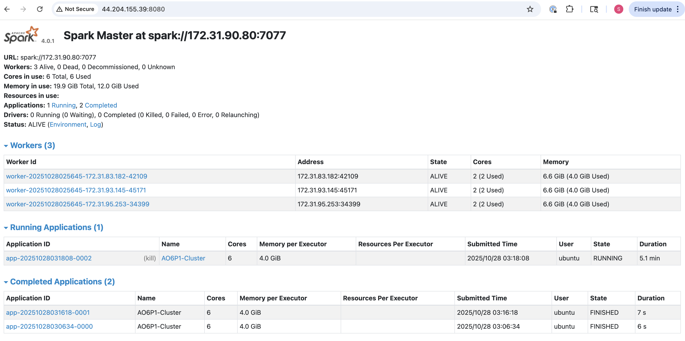
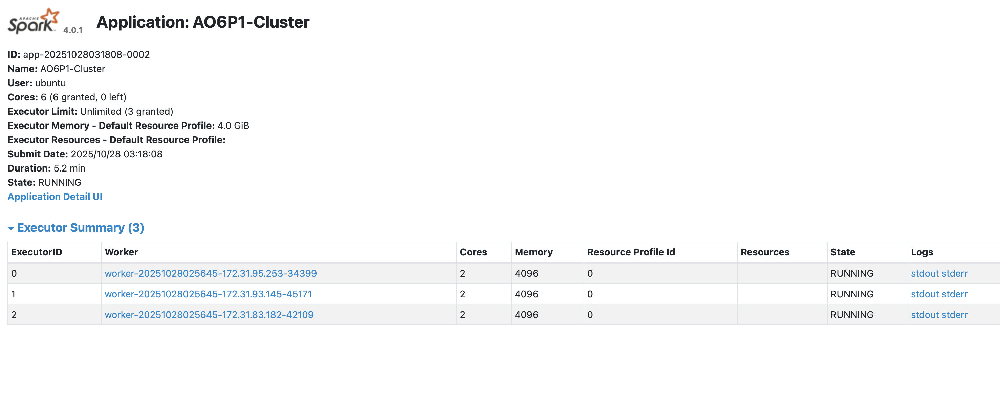
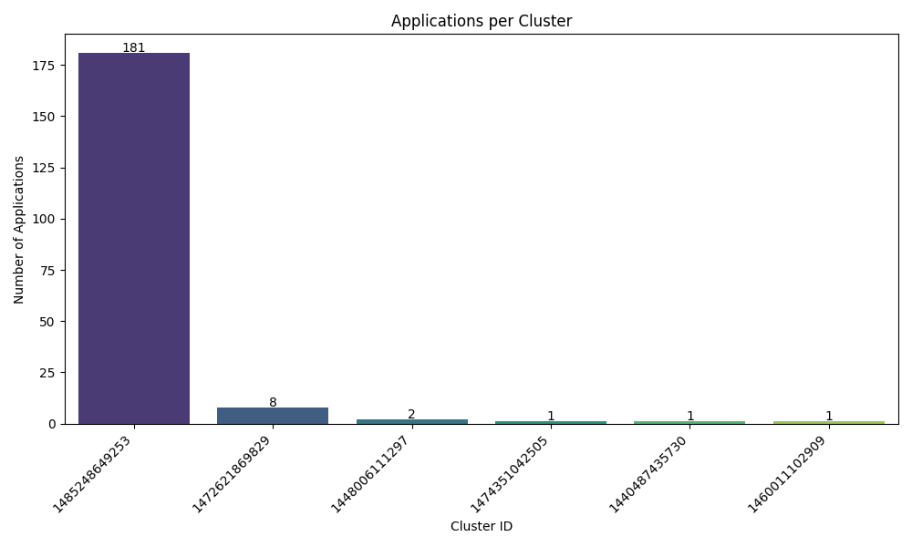

# Analysis File
AUTHOR: Sophie McDowall

## Approach Descriptions

For each problem, the python files were tested as local files on a sample of the data and then adjusted to run on the full spark cluster.

For problem 1, I referenced the previous lab 7 to format my .py file. I structured the script with different methods for each of the three desired outputs. To produce the outputs, I used various techniques to aggregate, filter, and identify counts based on groupings of the logs.

For problem 2, I adjusted the outline of the code to similarly build methods for each of the visualization tasks. One of the issues I ran into was with reading the data files in properly to build the time series -- while doing local sample testing, there were issues with reading in the timestamp as a timestamp. By using the "try to timestamp" feature it worked after doing some troubleshooting.

## Key Findings and Data Insights
  The overall findings from the analysis demonstrate that INFO logs are by far the most common type of logs present in the dataset. This makes sense given that WARN or ERROR logs would ideally be less common, as multiple logs providing info would happen on multiple runs of code wheras if WARN or ERROR logs appear those issues would likely be adjusted in the code. 

  It is also evident from the results of problem 2 that the majority of the applications were run on the same cluster, which is further demonstrated in the bar chart. The second visualization is helpful because it looks specifically at the cluster that had the majority of the applications, giving greater insight into the general time of the different cluster application executions.

## Performance Observations
 When working with the sampled data, it did not take long to test the python scripts which was very helpful for troubleshooting. When running on the cluster, it took much longer as expected. 

 Comparatively, problem 1 ran much faster than problem 2 on the cluster. This makes sense based on the requirements of each problem, especially considering that problem 2 has 5 parts vs. problem 1 which has 3 parts, including simpler functions like taking a random sample of 10 logs. For problem 2, both the outputs of the tasks are more complex (contain more information and building images/visualizations) and there is more being passed between the different functions that run in the scripts. For example, in problem 1, the output of the first count method is passed into the third method while in problem 2, the output of the timeseries is longer, passed into multiple other methods, and passed alongside outputs from other methods. Each of these are factors in the longer run time for the second problem. Problem 2 ended up running for over 20 minutes, while Problem 1 was much shorter. 

 An additional challenge of running the scripts on the cluster was the restrictions from the AWS learner lab. While running the python script for problem 2 on the cluster, the four hour timer ran out for AWS requiring a restart and a full restart of the process. 

## Screenshots of Spark Web UI
The below screenshots are from the running process of problem 1, including the overal Web UI and the stages of different cluster applications.

*Spark Web UI Screenshot 1: Overall Cluster Running Snapshot*

*Spark Web UI Screenshot 2: Application Running Snapshot*

*Spark Web UI Screenshot 3: Application Completed Task Snapshot*

## Visualization Explanations
 The below visualizations were produced by running problem 2. 

*Problem 2 Bar Chart, Full Cluster Run*

This bar chart clearly demonstrates the high proportion of applications were run on one primary cluster, while the rest of the identified unique clusters had much lower counts of applications.

*Problem 2 Density Plot, Full Cluster Run*

Using the data from the main cluster that included over 90% of the applications included in the dataset. Looking at the timing of these, the density graph shows that the large majority ran in less than 10^3 seconds on a log scale, around 16 minutes long as a run time. This demonstrates that the majority of the applications ran on a shorter time scale (relative to cluster timing) while some ran much longer (for multiple hours).
  

